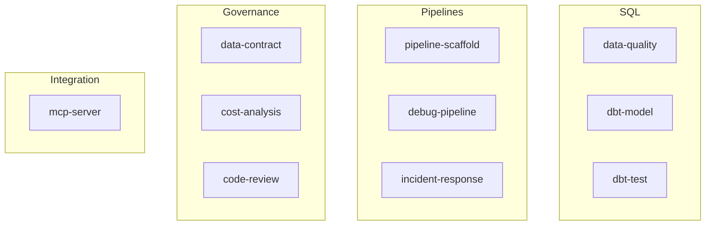
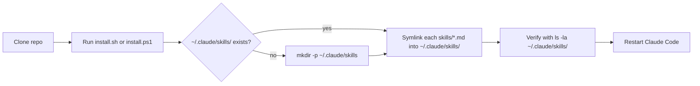

# Data Engineering Claude Skills Architecture

A curated catalog of Claude Code skills that encode production data engineering patterns. Each skill is a Markdown file with YAML frontmatter. Installation is a thin symlink step so edits in this repo are picked up by Claude Code immediately.

## Structure

```
data-engineering-claude-skills/
  skills/                  # 13 .md skill files
  install.sh               # Unix symlink install
  install.ps1              # Windows symlink install
  README.md
  SETUP_GUIDE.md
```

Each file in `skills/` has two parts: a YAML frontmatter block declaring `name` and `description`, and a body containing the instructions Claude executes when the skill is invoked.

## Skill Lifecycle


Because `install.sh` creates symlinks, edits made in the repo propagate to Claude Code without a reinstall.

## Skill Categories



## Skill Catalog

| Skill | Category | Purpose |
|---|---|---|
| `data-quality` | SQL | Run a data quality audit on a Snowflake table or PySpark DataFrame |
| `dbt-model` | SQL | Generate a production dbt model with sources, tests, and docs |
| `dbt-test` | SQL | Create dbt tests including custom generic tests |
| `pipeline-scaffold` | Pipelines | Scaffold a new PySpark or Glue pipeline with CI and monitoring |
| `debug-pipeline` | Pipelines | Structured diagnosis for PySpark, Glue, Airflow, or Kafka failures |
| `incident-response` | Pipelines | Guide an on-call engineer through triage, mitigation, and postmortem |
| `data-contract` | Governance | Draft a data contract for a producer and consumer pair |
| `cost-analysis` | Governance | Analyze AWS Glue, EMR, or Snowflake cost hotspots |
| `code-review` | Governance | Review SQL or PySpark for correctness, performance, security |
| `mcp-server` | Integration | Build a FastMCP Python MCP server with tools, resources, prompts |

Additional skills may be added in `skills/`. The catalog is intentionally flat so new skills are discoverable with a single `ls`.

## File Anatomy

```markdown
---
name: data-quality
description: Run a data quality audit on a Snowflake table or PySpark DataFrame. Use when the user asks about nulls, duplicates, schema drift, or freshness.
allowed-tools: Read, Bash, Grep
---

# Data Quality Audit

## When to use
...

## Steps
1. ...
2. ...

## Example
...
```

## Install Flow



## Design Principles

- One file per skill, no hidden includes.
- Frontmatter is the contract, body is the behavior.
- Skills prefer idempotent, read-only operations by default.
- Destructive actions require explicit user confirmation inside the skill body.
- Every skill ships with a concrete example so Claude knows the expected shape of input and output.

## Extension Points

- New category: add files to `skills/` and document them in this catalog.
- Per-user overrides: users can copy a skill into `~/.claude/skills/` as a regular file to break the symlink and customize locally.
- CI validation: GitHub Actions checks that every skill file has valid frontmatter with `name` and `description`.
